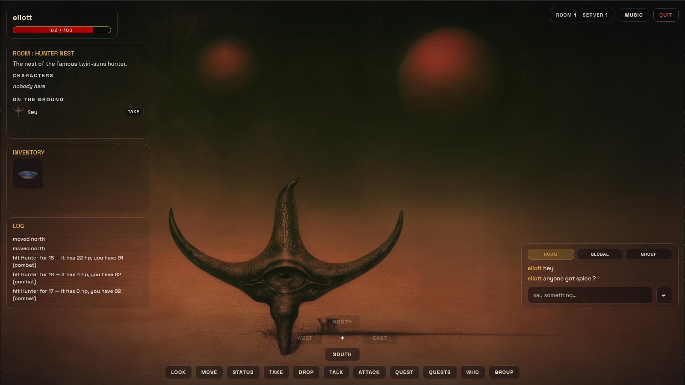

_This project has been created as part of the 42 curriculum by qbourine, epesnel_

# The Answer Protocol (TAP)

### A multiplayer adventure in a Dune x Beksinski inspired world



## Description

The project is a small multiplayer text adventure (MUD) played over **RFC 42TAP**, a
line-based TCP protocol: one UTF-8 command per line, one `OK`/`ERR` reply per
command, plus asynchronous `EVT` broadcasts for things other players do.

Several players connect to the same server, walk a shared world, pick up
items, talk to NPCs, take quests, fight, chat and form groups. Because the
protocol is the contract, any group's client must work against any group's
server.

The repository holds three components and the world they share:

| Component | Path | What it is |
|---|---|---|
| Server | `core/cmd/server` | authoritative game state, one process, many players |
| CLI client | `core/cmd/cli` | terminal client that translates a friendlier syntax to RFC |
| GUI client | `gui/` | Wails desktop client (Go backend + HTML/JS frontend) |
| World | `data/world.json` | every room, item, NPC and quest — no content in code |

Stack: **Go** (standard library only, server side) + **Wails v2** for the GUI.

## Instructions

Requires Go 1.27+, and — for the GUI only — Node.js, the Wails CLI and
WebKitGTK development headers.

```sh
make deps      # Go module downloads
make server    # build and run the server on :4241
make cli       # build and run a terminal client
make gui       # run the GUI (wails dev)
```

If `make gui` fails on a missing `webkit2gtk-4.0` and you have no root
access (42 lab machines), `make webkit-dev` unpacks the development headers
into `~/.local` and rewrites their `pkg-config` prefixes — no `sudo`, no
system change. Run it once, then `make gui` as usual.

See **Building and Running** below for the full target list.

## Resources

https://go.dev/doc/ \
https://wails.io/fr/docs/introduction/

Midjourney was used to create the rooms background images

Ai was used to provide general directions, blueprints and to explain concepts.


## Architecture

**One dispatcher, thin handlers.** Each connection runs a read loop that
parses a line into a `protocol.Command` and hits a single `switch` on the
verb, which calls a `handle*` method. No router table, no middleware: with
17 verbs, a switch is the shortest path from line to behaviour, and it fails
loudly (a `WARN`) if a verb is ever added to the protocol without a handler.

**Layers.** `core/protocol` knows the wire format and nothing about the game.
`core/world` loads and validates `data/world.json` and knows nothing about
connections. `core/server` owns the mutable state and is the only place the
two meet. Both clients speak only through `core/protocol`, so neither can
drift from what the server emits.

**Concurrency.** Two goroutines per connection — a reader that parses and
dispatches, and a writer that drains a buffered channel to the socket. All
shared game state (players, groups, floor items, NPC health, quest progress)
lives in one `Hub` behind one mutex. Whole operations are resolved inside a
single lock acquisition, so two players racing the same TAKE, or the same
killing blow, can never both succeed. The writer channel is what keeps a
slow or dead client from stalling a broadcast to everyone else: a send that
would block is dropped, never waited on.

**Fail fast at startup.** The world is validated before the socket opens —
every exit, item, NPC and quest reference must resolve, the map must be fully
connected in both directions and contain a real loop. A broken world file is
a startup error with a precise message, never a surprise at runtime.

## Protocol Implementation

Deviations, ambiguities and gaps, one line each. Full reasoning for every
entry is in [`docs/decisions.md`](docs/decisions.md).

| # | Decision |
|---|---|
| D1 | §2.1 says LF, §3.1's grammar says CRLF — we emit LF and strip a trailing CR on receive, so both readings interoperate. |
| D2 | `WHO` follows the RFC (`players=<count>`), not the subject PDF's JSON example, because the RFC is the interoperability contract. |
| D3 | Code `404` covers three conditions, so all dispatch keys on the *symbol*; the code is used only for the fatal/recoverable split. |
| D4 | `EVT GROUP INVITE` has no group slot, so it carries the inviter's name — and `GROUP JOIN` accepts either a group id or a player name. |
| D5 | Two codes added in the RFC's own ranges for gaps it leaves: `202 NOT_CONNECTED`, `400 BAD_REQUEST`. Receive-side only. |
| D6 | A command is `{verb, scope, sub, arg}` with one free-form rest-of-line arg, so multi-word chat and item names survive. |
| D7 | JSON payloads are compact (a newline would split a message) and an empty collection is `[]`, never `null`. |
| D8 | One parser rule: accept unknown constructs, reject malformed known ones. Usernames must be a single token. |
| D9 | `Format*` emits the line terminator itself, so no caller can forget it and glue two messages together. |
| D10 | Quests have no accept step — `QUEST <npc>` offers *and* accepts — and completion is a side effect of `TALK`/`ATTACK`, not a new command. |
| D11 | Ids are made canonical (`loc.`/`item.`/`npc.`) once at load, so the world file stays readable and the wire stays unambiguous. |
| D12 | A group id is its creator's name, numerically suffixed on collision — no counter, no coordination. |
| D13 | `ENTER`/`LEAVE` events exclude the player who caused them (they already got a reply); `CHAT` includes the sender, per the RFC's example. |
| D14 | `TALK` cycles an NPC's dialogue lines; `QUEST`'s description is the quest's own state dialogue. |
| D15 | Combat design — see **Combat System**. |
| D16 | `DEFEND` and `FLEE` are our own commands, not RFC; a peer may answer `400`, which our clients surface as an error. |
| D17 | Logging and abuse monitoring — see **Server Logging**. |
| D18 | Malformed-input hardening: control characters rejected in usernames, oversized lines answered with `400` instead of silently dropped. |
| D19 | The CLI is the subject's "translating layer" option, not raw pass-through. |
| D20 | An item id is a single instance: a ledger of what exists stops quest grants and rewards from minting duplicates. |
| D21 | An enemy may name an item its attacker needs; without it, hits land for 1 damage. |

## Combat System

**A turn is one `ATTACK`.** The whole exchange resolves inside one call:
your hit lands first, and if the target survives it counters immediately.
There is no initiative roll and no scheduler — the attacker always strikes
first, and no combat state outlives a single command.

**Damage.** `roll(base)` = base ±20% (at least ±1), never below 1. Players
hit for a flat base of 15 — there is no weapon system. NPCs hit for their own
`stats.damage` from the world file.

**Health.** Players start at 100 HP. There is no healing: at 0 HP you respawn
in the start room at 50 HP, keeping your inventory. NPCs never respawn — a
dead enemy stops appearing in `LOOK` and answers `404` for good.

**Extra commands** (ours, not RFC):

- `DEFEND` — arms a one-shot flag halving the next hit you take.
- `FLEE` — forced move through a random ungated exit, taking one free
  counter-attack on the way out.

**Two rules worth knowing.** A kill closes the kill quest for *every* player
holding it, but the reward is a unique item, so it goes to whoever landed the
blow. And the boss ignores anyone not carrying the crysknife: their hits land
for 1 damage, which is what the bone quest's reward is for.

## Quest System

Two quests, both defined entirely in `data/world.json`:

| Quest | Type | Giver | Objective | Reward |
|---|---|---|---|---|
| `bone` | deliver | barman | bring the bone to the dog in the suburbs | crysknife |
| `hunter` | kill | vendor | kill the twin-suns hunter | water |

**Progression.** `QUEST <npc>` both offers and accepts — asking is taking, so
there is no accept command the RFC never defined. A deliver quest hands you
the item to carry at that moment. `QUESTS` lists what you hold, active or
completed, with progress.

**Validation.** Completion is checked on the commands that would naturally
cause it, never on a timer: `TALK` to a delivery target while carrying the
item closes a deliver quest, and an enemy's death closes a kill quest. A
quest-giver's dialogue changes with the state (offer / active / complete).

**Rewards.** Granted through the same uniqueness ledger as every other item,
so a reward exists exactly once server-wide. A consumed quest item is
destroyed and its id freed, letting the next player take the same quest.

## World Design

10 rooms, 6 items, 6 NPCs across the 3 required roles, and one real loop:
`start → city → square → camp → door → suburbs → start`.

```
                      bossroom                nest
                       (boss)               (hunter)
                          |                     |
                        [key]                   |
                          |                     |
   suburbs ------------ door ---------------- camp
    (dog)                                       |
      |                                         |
    start ------------- city --------------- square ------------ bar
                       (guard)                  |             (barman)
                                                |
                                              shop
                                            (vendor)
```

**NPC roles.** *dialogue* — guard, dog. *quest-giver* — barman, vendor.
*enemy* — hunter, boss.

**Item distribution.** Two lie on the floor to be taken (spice in the shop,
liquor in the bar). The key is a drop from the hunter. The bone is handed
over by a quest, and the crysknife and water are quest rewards. Each item
enters the world from exactly one place, which the validator enforces.

**Gating.** `door → bossroom` needs the key, so the boss sits behind the
hunter; and hurting the boss needs the crysknife, so it also sits behind the
bone quest. A blocked exit answers `301 NO_EXIT` rather than a new error code.

## Server Logging

`log/slog` with a JSON handler on **stdout**, set once in `main`. Every
record carries a timestamp and a level.

| Level | What |
|---|---|
| `INFO` | connect/disconnect (+remote), every command (+player, verb, args), every reply (`ok`/`err` + code + symbol), item taken/dropped, quest accepted/completed, NPC killed, player respawned |
| `WARN` | abuse signals only (below), plus one defensive case that should be unreachable |
| `ERROR` | payload marshal failure, and startup failures (bad world file, listen error) |

Replies are logged at a single choke point — the one function every reply and
broadcast passes through — so no handler can forget to log its outcome. Large
payloads are truncated to keep a log tail readable.

**Abuse detection** (RFC §9.4). Counting and logging only, never banning:
inventing a ban would need a wire behaviour the RFC does not define, and a
false positive would eject a real player.

- **Flood** — 20 commands within 2 seconds on one connection.
- **Reconnect** — 3 connections from one host within 10 seconds.

Both use a sliding window and fire **once**, on the tick the threshold is
crossed, so a sustained flood is one line and not thousands.

**Monitoring.**

```sh
./bin/server | jq .                                  # readable stream
./bin/server | jq 'select(.level=="WARN")'           # abuse only
./bin/server | jq 'select(.player=="alice")'         # one player's session
```

## Group Contributions

Quentin : Server, cli

Eliott : World design, protocol, GUI

## Building and Running

Everything goes through the Makefile.

| Target | What it does |
|---|---|
| `make deps` | download Go modules for both modules |
| `make build` | build `bin/server` and `bin/cli` |
| `make server` | build and run the server on `:4241` |
| `make cli` | build and run a CLI client against `localhost:4241` |
| `make gui` | run the GUI in dev mode |
| `make gui-multi` | run a **second** GUI in parallel, for multiplayer testing |
| `make gui-build` | produce a packaged GUI binary |
| `make webkit-dev` | install WebKitGTK headers into `~/.local` without root |
| `make lint` | `gofmt -l` + `go vet` |
| `make test` | full test suite, server side with `-race` |
| `make clean` | remove build output |

**Server.** `./bin/server -addr :4241 -world data/world.json`. Both flags
have those values as defaults.

**CLI client.** `./bin/cli -addr localhost:4241`. It translates a friendlier
syntax (`go north` → `MOVE north`, `say hi` → `CHAT ROOM hi`, plus
`shout`/`gsay`) and pretty-prints JSON payloads and events in colour.
Anything it does not recognise is sent verbatim, so full RFC syntax always
works. `-raw` disables both directions and gives you the wire itself.

**GUI client.** `make gui`; enter a server address and a name in the connect
screen (`localhost:4241` by default). `make gui-multi` starts a second
instance on its own dev-server port so two windows can play on one machine.

## Testing

```sh
make test        # everything: protocol, world, server, GUI backend
make lint
```

The server tests run with `-race` and drive a **real server over a real
socket**, not mocks — each test connects clients, sends commands and asserts
on the replies.

**Multiplayer.** Start `make server`, then any mix of `make cli`, `make gui`
and `make gui-multi`. Walk two clients into the same room and check that a
move, a chat message or a kill shows up in the other window.

Automated coverage: 20 clients connected, chat-spamming, with half of them
killed mid-broadcast by an abrupt reset — survivors must keep receiving
events and the player count must settle correctly.

**Combat.** Automated tests walk the real routes: kill the hunter, take the
key, open the gate, and check the boss shrugs off a player without the
crysknife but fights normally with it. Manually: `make server`, then
`ATTACK npc.hunter` from the nest, trying `DEFEND` and `FLEE` between rounds.

**Quests.** Tests cover both quests end to end, including the cases that only
appear with several players: two players holding the same delivery quest must
not produce two bones, and a shared kill must not produce two rewards.

**Malformed input.** A gauntlet fires unknown verbs, missing arguments, binary
junk, oversized lines, commands before `CONNECT` and commands split across
two TCP writes, asserting a correct reply every time and no leaked player.
